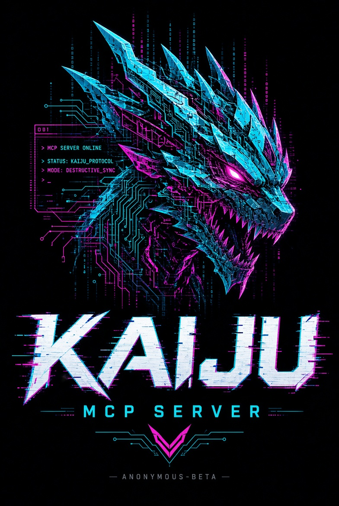

<p align="center">
  
</p>

<h1 align="center">🦖 KAIJU — The Monster MCP Server</h1>

<p align="center">
  <b>The standalone, AI-powered MCP server for Linux pentesting.</b><br/>
  Recon · Scanning · Web attacks · Exploit checks · Payload library · AI brain<br/>
  Wrapped in a beautiful terminal UI with signature timestamps.
</p>

<p align="center">
  <a href="#-installation"></a>
  <a href="#-the-arsenal"></a>
  <a href="#-ai-configuration"></a>
  <a href="#-license"></a>
</p>

<p align="center">
  
  
  
  
</p>

<pre align="center">
██╗  ██╗ █████╗ ██╗     ██╗██╗   ██╗
██║ ██╔╝██╔══██╗██║     ██║██║   ██║
█████╔╝ ███████║██║     ██║██║   ██║
██╔═██╗ ██╔══██║██║     ██║██║   ██║
██║  ██╗██║  ██║███████╗██║╚██████╔╝
╚═╝  ╚═╝╚═╝  ╚═╝╚══════╝╚═╝ ╚═════╝
</pre>

<p align="center"><i>“Kaiju awakens. Target acquired.”</i> — <b>Anonymous-beta</b></p>

<hr/>

## 🥊 Why KAIJU

| Feature | KAIJU | Typical MCP server |
|---|---|---|
| Recon arsenal (DNS, subdomains, WHOIS, OSINT, AXFR) | ✅ built-in | ❌ separate tools |
| Threaded port scanner + banner grab | ✅ built-in | ❌ |
| Web beast mode (dir fuzz, header audit, WAF detect, fingerprint) | ✅ built-in | ❌ |
| Exploit checks (SQLi / XSS / LFI / header injection) | ✅ built-in | ❌ |
| **Payload library exposed as an MCP tool** | ✅ **exclusive** | ❌ nobody has this |
| **AI brain embedded as an MCP tool** (`ai_analyze`) | ✅ **exclusive** | ❌ |
| **Paste-and-go AI API setup wizard** | ✅ **exclusive** | ❌ |
| Signature colored timestamps | ✅ | some |
| Interactive terminal cockpit (TUI) | ✅ **exclusive** | ❌ |
| One-command install + config at `~/.config/kaiju` | ✅ | ❌ |

> <b>“If we can't make it better than the others, we make it have something the others don't have.”</b>
>
> KAIJU ships four things nobody else does: the **payload library as a tool**, the **embedded AI brain**, the **paste-and-go wizard**, and the **cockpit**.

<hr/>

## 🚀 Installation

<details open>
<summary><b>🐧 Requirements</b></summary>

| Requirement | Notes |
|---|---|
| Linux | Kali / Parrot / Ubuntu / Debian recommended |
| Python | **3.10+** |
| `nmap`, `traceroute` | optional but recommended (`apt install nmap traceroute`) |

</details>

<details>
<summary><b>📦 Install from source</b></summary>

```bash
git clone https://github.com/Anonymous-beta/kaiju.git
cd kaiju
python3 -m venv .venv && source .venv/bin/activate
pip install -e .
kaiju banner
```

</details>

<details>
<summary><b>⚡ Zero-install launcher</b></summary>

```bash
pip install -r requirements.txt
python3 run.py            # splash + help
python3 run.py run        # fire up the MCP server
```

</details>

<details>
<summary><b>✅ Quick sanity check</b></summary>

```bash
kaiju banner              # the beast wakes up
kaiju tools               # list the full arsenal
kaiju config --ai         # paste your AI API key
kaiju run                 # start the MCP server (stdio)
```

</details>

<hr/>

## 🎯 Quick Start

```bash
# 1. Configure the AI (paste your key — done in ~30 seconds)
kaiju config --ai

# 2. Fire up the server (stdio for Claude Desktop / Cursor)
kaiju run

# 3. Or go interactive — the cockpit
kaiju tui
```

<hr/>

## 🤖 AI Configuration — paste & go

```bash
kaiju config --ai
```

The wizard asks for a **provider**, you **paste your API key**, it **tests the connection**, and done. KAIJU connects instantly.

| Provider | Endpoint | Default model |
|---|---|---|
| OpenAI | `api.openai.com/v1` | `gpt-4o-mini` |
| OpenRouter | `openrouter.ai/api/v1` | `openai/gpt-4o-mini` |
| Groq | `api.groq.com/openai/v1` | `llama-3.3-70b-versatile` |
| Together | `api.together.xyz/v1` | `Llama-3.3-70B-Instruct-Turbo` |
| Mistral | `api.mistral.ai/v1` | `mistral-small-latest` |
| Ollama (local) | `localhost:11434/v1` | `llama3.1` |
| Custom | any OpenAI-compatible URL | anything |

> 💡 Local Ollama with no key works too — KAIJU is fully offline-capable.

<hr/>

## 🔌 Connecting MCP Clients

<details>
<summary><b>💬 Claude Desktop</b></summary>

Edit `~/.config/Claude/claude_desktop_config.json`:

```json
{
  "mcpServers": {
    "kaiju": {
      "command": "kaiju",
      "args": ["run"]
    }
  }
}
```

</details>

<details>
<summary><b>🧑‍💻 Cursor / IDE agents</b></summary>

```json
{
  "mcpServers": {
    "kaiju": {
      "command": "kaiju",
      "args": ["run"]
    }
  }
}
```

</details>

<details>
<summary><b>🌐 Custom client over SSE</b></summary>

```bash
kaiju run --transport sse --host 127.0.0.1 --port 8765
```

```python
# examples/kaiju_sse_client.py
import asyncio
from mcp import ClientSession
from mcp.client.sse import sse_client

async def main():
    async with sse_client("http://127.0.0.1:8765/sse") as (read, write):
        async with ClientSession(read, write) as session:
            await session.initialize()
            tools = await session.list_tools()
            print(f"⚡ KAIJU connected — {len(tools.tools)} tools armed")

asyncio.run(main())
```

</details>

<hr/>

## 🛠️ The Arsenal — 25 tools

### `recon` — know your enemy
| Tool | What it does |
|---|---|
| `dns_lookup` | A / AAAA / MX / TXT / NS / CNAME / SOA / PTR |
| `subdomain_enum` | 200+ word built-in list, threaded, custom wordlist support |
| `whois_lookup` | registrar, dates, nameservers, contacts |
| `osint_lookup` | WHOIS + DNS + IP + DMARC + PTR snapshot |
| `reverse_dns` | IP → hostname |
| `zone_transfer` | AXFR attempt against every nameserver |

### `network` — map the battlefield
| Tool | What it does |
|---|---|
| `ping_sweep` | ranges / CIDR / lists, threaded |
| `port_scan` | top-100 or custom ranges, banners, 200 threads |
| `traceroute` | network path |
| `http_probe` | status, size, title, server header |
| `nmap_scan` | full system-nmap wrapper |

### `web` — eat the web
| Tool | What it does |
|---|---|
| `dir_fuzz` | 100+ built-in paths, extensions, threaded |
| `header_audit` | finds the 8 critical headers you're missing |
| `waf_detect` | Cloudflare / Akamai / Imperva / AWS / F5 + payload probes |
| `tech_fingerprint` | server, CMS, framework, JS libs, version hints |

### `exploit` — the teeth
| Tool | What it does |
|---|---|
| `sqli_check` | time-delay + error-pattern + boolean-blind probes |
| `xss_check` | reflection sniffing with markers |
| `lfi_check` | traversal + `php://filter` + `/proc/self/environ` |
| `header_injection_check` | CRLF, CORS, Host-header |
| `payload_library` | **100+ payloads in 11 categories** — as an MCP tool |

### `system` — local power (safe by default)
| Tool | What it does |
|---|---|
| `command_exec` | shell commands, **safe_mode allowlist** by default |
| `file_read` | text files, 10MB cap, tree-restricted in safe_mode |
| `file_write` | write files, tree-restricted in safe_mode |
| `list_directory` | listing with sizes |

### `ai` — the brain
| Tool | What it does |
|---|---|
| `ai_analyze` | paste tool output → AI explains findings + next attack steps |

<hr/>

## 💣 The Payload Library

11 categories, 100+ payloads, browsable via the `payload_library` MCP tool:

```
sqli, xss, lfi, rce, ssrf, idor, auth, headers,
deserialization, upload, crypto, misc
```

Example MCP call:

```
payload_library("ssrf")
```

```text
[ssrf]
  • Localhost: http://127.0.0.1/
  • Localhost hex: http://0x7f000001/
  • IPv6 loopback: http://[::1]/
  • AWS metadata: http://169.254.169.254/latest/meta-data/
  • gopher: gopher://127.0.0.1:6379/_INFO
  • dict: dict://127.0.0.1:11211/info
  ...
```

<hr/>

## 🛡️ Safe Mode

KAIJU ships with `safe_mode: true`:

- `command_exec` only runs **allowlisted binaries** (`nmap`, `curl`, `dig`, …) — no shell metacharacters, no `rm`, `mkfs`, `dd`, etc.
- interpreted shells (`bash -c`, `python3 -c`) are blocked
- `file_read` / `file_write` restricted to the working tree
- exploit checks are **non-invasive probes** (single benign request)

Run KAIJU on a box you own and disable it when you're ready to go full monster:

```bash
kaiju config --set 'safe_mode false'
```

<hr/>

## 🕹️ CLI Reference

| Command | What it does |
|---|---|
| `kaiju` | splash + help |
| `kaiju run` | MCP server (stdio) |
| `kaiju run --transport sse --host 127.0.0.1 --port 8765` | MCP server (SSE) |
| `kaiju config --ai` | paste-and-go AI wizard |
| `kaiju config --show` | dump config JSON |
| `kaiju config --set 'ai.model gpt-4o'` | set any value |
| `kaiju config --reset` | factory reset |
| `kaiju tools` | arsenal table |
| `kaiju ai "how do I test for SSRF here?"` | ask the AI brain |
| `kaiju tui` | interactive cockpit |
| `kaiju banner` | print the banner |
| `kaiju --version` | version |

<hr/>

## 🗂️ Project Structure

<details>
<summary><b>Click to expand</b></summary>

```text
kaiju/
├── run.py                     # zero-install launcher
├── setup.py / pyproject.toml  # packaging
├── assets/kaiju-logo.png      # the logo
├── examples/                  # client configs + SSE demo
└── kaiju/
    ├── banner.py              # the Kaiju splash
    ├── timestamps.py          # signature timestamps
    ├── config.py              # XDG config + providers
    ├── ai.py                  # OpenAI-compatible AI client
    ├── server.py              # MCP server core
    ├── cli.py                 # CLI entry
    ├── tools/                 # the arsenal
    │   ├── recon.py  network.py  web.py  exploit.py  system.py
    └── ui/tui.py              # interactive cockpit
```

</details>

<hr/>

## 🗺️ Roadmap

- [ ] More payloads (every category, 500+)
- [ ] Metasploit bridge
- [ ] Session / report export (JSON, HTML, markdown)
- [ ] Windows client (cockpit only)
- [ ] Plugin system

<hr/>

## 📜 License

MIT — Copyright © 2026 **Anonymous-beta**.

<p align="center">
  <i>“Ndi Igbo kwenu”</i> 🦖
</p>
